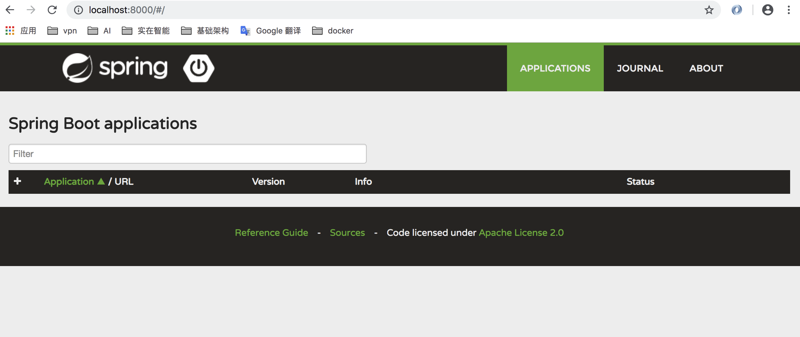
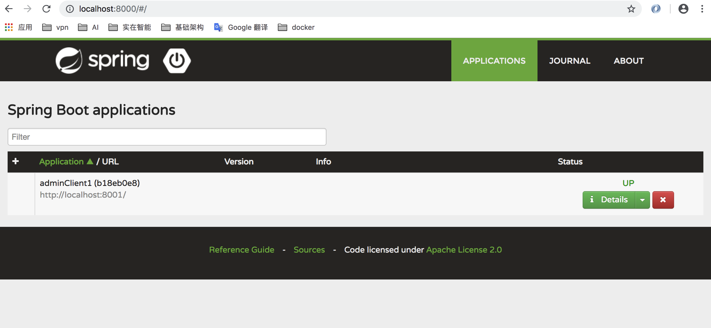
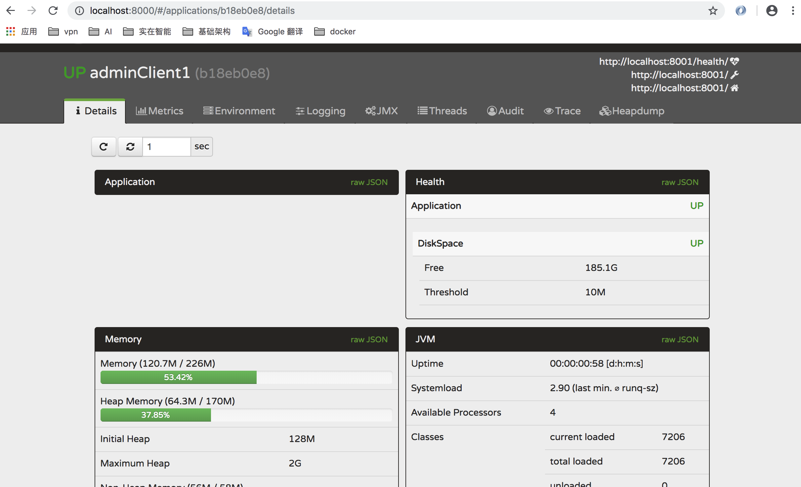
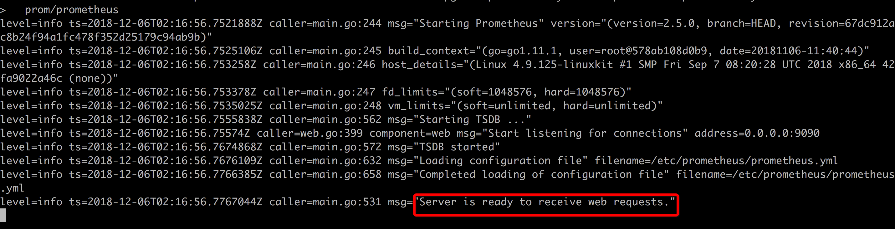
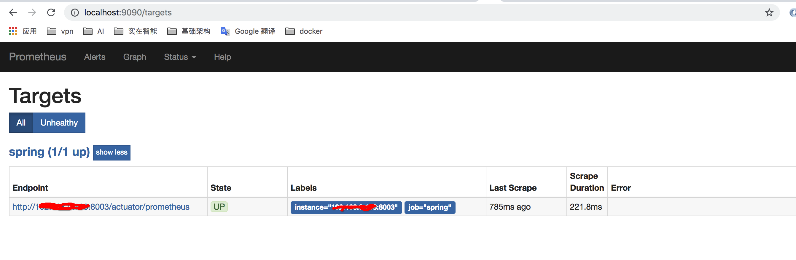
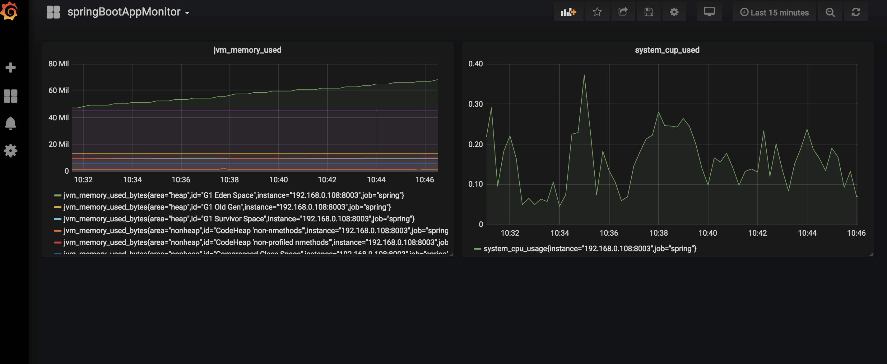

[TOC]

# springBoot微服务监控方案

## 一、技术方案

| 方案                                        | 优点                                                         | 缺点                                                         |
| ------------------------------------------- | ------------------------------------------------------------ | ------------------------------------------------------------ |
| Springboot+spring-boot-actuator             | 1、搭建配置简单，只需要添加spring-boot-actuator的依赖即可<br />2、支持多个端点的监控配置<br /> | 1、监控数据为json，可读性差<br />2、只能部署在单个springboot应用上，没有集群级别的监控<br /> |
| springBoot+ spring-boot-admin               | 1、支持springboot应用的集群监控<br />2、具有可视化页面，可读性好<br />3、可定制化某个端点的监控，比如dbcounter<br />4、提供邮件组件，可以支持邮件告警<br />5、支持访问权限配置 | 1、引入第三方de.codecentric的包<br />2、可视化界面非曲线形，阅读效果稍差<br />3、提供接口trace监控，但是json格式，而且不支持接口分类<br />4、需要单独搭建一个SBA的server节点 |
| Springboot + actuator +prometheus + Grafana | 1、可自定义监控仪表盘<br />2、支持多种类型的数据源监控，比如prometheus，mysql、Elasticsearch等<br />3、支持邮件告警<br />4、接入简单，只需应用系统添加prometheus的依赖和相关配置即可<br />5、支持集群监控<br />6、支持多人访问权限的配置<br />7、支持docker<br />8、有prometheus的社区 | 1、整套环境搭建稍微复杂，需要搭建prometheus数据采集服务节点，graphna图像监控服务节点<br /> |

## 二、搭建方法

### 2.1 spring-boot-acuator的监控搭建方式

* 新建一个springboot应用
* 添加spring-boot-acuator依赖
* 启动，访问http://ip:port/acuator 即可看到相关的json数据

```
springBoot2.x 版本和1.x 版本有所不同，2.X版本默认uri为/acuator, 1.X版本默认为/health 等
```


#### 2.1.1、maven的方式

```xml
<?xml version="1.0" encoding="UTF-8"?>
<project xmlns="http://maven.apache.org/POM/4.0.0" xmlns:xsi="http://www.w3.org/2001/XMLSchema-instance"
	xsi:schemaLocation="http://maven.apache.org/POM/4.0.0 http://maven.apache.org/xsd/maven-4.0.0.xsd">
	<modelVersion>4.0.0</modelVersion>

	<groupId>com.example</groupId>
	<artifactId>spg</artifactId>
	<version>0.0.1-SNAPSHOT</version>
	<packaging>jar</packaging>

	<name>spg</name>
	<description>Demo project for Spring Boot</description>

	<parent>
		<groupId>org.springframework.boot</groupId>
		<artifactId>spring-boot-starter-parent</artifactId>
		<version>2.1.1.RELEASE</version>
		<relativePath/> <!-- lookup parent from repository -->
	</parent>

	<properties>
		<project.build.sourceEncoding>UTF-8</project.build.sourceEncoding>
		<project.reporting.outputEncoding>UTF-8</project.reporting.outputEncoding>
		<java.version>1.8</java.version>
	</properties>

	<dependencies>
		<dependency>
			<groupId>org.springframework.boot</groupId>
			<artifactId>spring-boot-starter</artifactId>
		</dependency>

		<dependency>
			<groupId>org.springframework.boot</groupId>
			<artifactId>spring-boot-starter-test</artifactId>
			<scope>test</scope>
		</dependency>

		<dependency>
			<groupId>org.springframework.boot</groupId>
			<artifactId>spring-boot-starter-web</artifactId>
		</dependency>

		<dependency>
			<groupId>org.springframework.boot</groupId>
			<artifactId>spring-boot-starter-actuator</artifactId>
		</dependency>

	</dependencies>

	<build>
		<plugins>
			<plugin>
				<groupId>org.springframework.boot</groupId>
				<artifactId>spring-boot-maven-plugin</artifactId>
			</plugin>
		</plugins>
	</build>


</project>

```


#### 2.1.2、gradel 的方式 

build.gradle

```groovy
buildscript {
    ext {
        springBootVersion = '2.1.1.RELEASE'
    }
    repositories {
        jcenter()
        mavenCentral()
    }
    dependencies {
        classpath("org.springframework.boot:spring-boot-gradle-plugin:${springBootVersion}")
    }
}


apply plugin: 'java'
apply plugin: 'idea'
apply plugin: 'jdepend'
apply plugin: 'application'
apply plugin: 'org.springframework.boot'
apply plugin: 'io.spring.dependency-management'


mainClassName = "com.example.gradle.BootApplication"

group 'com.example.gradle'
version '1.0-SNAPSHOT'

sourceCompatibility = 1.8
targetCompatibility = 1.8

repositories {
    mavenCentral()
}

dependencies {
    implementation("org.springframework.boot:spring-boot-starter-web")
    implementation('org.springframework.boot:spring-boot-starter-actuator')
    testCompile("org.springframework.boot:spring-boot-starter-test")
}

```


#### 2.1.3、数据样例

默认访问http://localhost:8080/acuator， 笔者修改了端口为8003

```json
{
_links: {
self: {
href: "http://localhost:8003/actuator",
templated: false
},
health: {
href: "http://localhost:8003/actuator/health",
templated: false
},
health-component-instance: {
href: "http://localhost:8003/actuator/health/{component}/{instance}",
templated: true
},
health-component: {
href: "http://localhost:8003/actuator/health/{component}",
templated: true
},
env: {
href: "http://localhost:8003/actuator/env",
templated: false
},
env-toMatch: {
href: "http://localhost:8003/actuator/env/{toMatch}",
templated: true
},
info: {
href: "http://localhost:8003/actuator/info",
templated: false
},
heapdump: {
href: "http://localhost:8003/actuator/heapdump",
templated: false
},
threaddump: {
href: "http://localhost:8003/actuator/threaddump",
templated: false
},
prometheus: {
href: "http://localhost:8003/actuator/prometheus",
templated: false
},
metrics: {
href: "http://localhost:8003/actuator/metrics",
templated: false
},
metrics-requiredMetricName: {
href: "http://localhost:8003/actuator/metrics/{requiredMetricName}",
templated: true
},
httptrace: {
href: "http://localhost:8003/actuator/httptrace",
templated: false
}
}
}
```


### 2.2 spirng-boot-admin的监控搭建方式

####2.2.1、新建一个spring-boot-admin server

```
spring-boot-admin server 提供数据收集和汇总的功能
```

基础依赖参考2.1 maven/gradle的配置

##### 2.2.1.1、 maven的方式

springBoot 2.x版本的不支持sba 1.X版本

```xml
<dependency>
    <groupId>de.codecentric</groupId>
    <artifactId>spring-boot-admin-server</artifactId>
    <version>2.1.2-SNAPSHOT</version>
</dependency>
<dependency>
    <groupId>de.codecentric</groupId>
    <artifactId>spring-boot-admin-server-ui</artifactId>
    <version>2.1.2-SNAPSHOT</version>
</dependency>


```

#####2.2.1.2、gradle 的方式

```groovy
dependencies {
    implementation("de.codecentrict:spring-boot-admin-server:2.1.2-SNAPSHOT")
    implementation("de.codecentrict:spring-boot-admin-server-ui:2.1.2-SNAPSHOT")
}
```

##### 2.2.1.3、配置启动类

添加@EnableAdminServer 注解

```java
@SpringBootApplication
@EnableAdminServer
public class AdminApplication {

	public static void main(String[] args) {
		SpringApplication.run(AdminApplication.class, args);
	}
}

```

##### 2.2.1.4、配置applicaiton.properties

```properties
server.port=8000
```



####2.2.2、新建一个spring-boot-admin client

```
spring-boot-admin client 就是上报监控数据的应用
```

基础依赖参考2.1 maven/gradle的配置

##### 2.2.2.1、maven的方式

```xml
<dependency>
    <groupId>de.codecentric</groupId>
    <artifactId>spring-boot-admin-starter-client</artifactId>
    <version>2.1.2-SNAPSHOT</version>
</dependency>
```

##### 2.2.2.2、gradle的方式

```groovy
dependencies {
    implementation("de.codecentrict:spring-boot-admin-starter-client:2.1.2-SNAPSHOT")
}
```

##### 2.2.2.3、配置application.properties

```properties
server.port=8001

spring.application.name=adminClient1

spring.boot.admin.url=http://localhost:8000  
management.security.enabled=false 
```

如果想使用spring-boot-security ，则management.security.enabled=true

client的启动类无需添加额外的注解，直接启动即可

- 通过SBA控制台访问相关监控项

```
默认访问地址 http://ip:port
```








参考资料

	> https://github.com/codecentric/spring-boot-admin
	>  http://www.ityouknow.com/springboot/2018/02/11/spring-boot-admin.html


### 2.3 spring-boot-acuator & prometheus & graphna的监控搭建方式

####2.3.1、新建一个spring-boot 工程

基础依赖参考2.1

##### 2.3.1.1、maven的方式

```xml
<dependency>
    <groupId>org.springframework.boot</groupId>
    <artifactId>spring-boot-starter-actuator</artifactId>
</dependency>

<dependency>
    <groupId>io.micrometer</groupId>
    <artifactId>micrometer-registry-prometheus</artifactId>
    <version>1.0.6</version>
</dependency>
```

##### 2.3.1.2、gradle的方式

```groovy
dependencies {
    implementation("io.micrometer:micrometer-registry-prometheu:1.0.6")
    implementation('org.springframework.boot:spring-boot-starter-actuator')
}
```

2.3.1.3、配置application.yml

```yml

server:
  port: 8003

spring:
  application:
    name: springbootApplication
  security:
    user:
      name: admin
      password: 000000

management:
  security:
    enabled: false
  # 仅限于 开发环境可对security进行关闭。
  metrics:
    export:
      prometheus:
        enabled: true
        step: 1m
        descriptions: true
  web:
    server:
      auto-time-requests: true
  endpoints:
    prometheus:
      id: springmetrics
    web:
      exposure:
        include:         health,info,env,prometheus,metrics,httptrace,threaddump,heapdump,springmetrics

```

注意：endpoints这个配置里一定要有prometheus

##### 2.3.1.3、启动数据节点

访问 http://localhost:8003/actuator/prometheus  能看到一下数据

```
# HELP tomcat_sessions_rejected_sessions_total  
# TYPE tomcat_sessions_rejected_sessions_total counter
tomcat_sessions_rejected_sessions_total 0.0
# HELP jvm_memory_used_bytes The amount of used memory
# TYPE jvm_memory_used_bytes gauge
jvm_memory_used_bytes{area="nonheap",id="CodeHeap 'non-nmethods'",} 2433792.0
jvm_memory_used_bytes{area="nonheap",id="Metaspace",} 4.6046104E7
jvm_memory_used_bytes{area="nonheap",id="Compressed Class Space",} 5817576.0
jvm_memory_used_bytes{area="heap",id="G1 Eden Space",} 7.6546048E7
jvm_memory_used_bytes{area="heap",id="G1 Old Gen",} 1.676032E7
jvm_memory_used_bytes{area="heap",id="G1 Survivor Space",} 5242880.0
jvm_memory_used_bytes{area="nonheap",id="CodeHeap 'non-profiled nmethods'",} 1.0934016E7
# HELP jvm_threads_live_threads The current number of live threads including both daemon and non-daemon threads
# TYPE jvm_threads_live_threads gauge
jvm_threads_live_threads 28.0
# HELP jvm_gc_memory_allocated_bytes_total Incremented for an increase in the size of the young generation memory pool after one GC to before the next
# TYPE jvm_gc_memory_allocated_bytes_total counter
jvm_gc_memory_allocated_bytes_total 8.1788928E7
# HELP jvm_threads_states_threads The current number of threads having NEW state
# TYPE jvm_threads_states_threads gauge
jvm_threads_states_threads{state="new",} 0.0
jvm_threads_states_threads{state="runnable",} 11.0
jvm_threads_states_threads{state="blocked",} 0.0
jvm_threads_states_threads{state="waiting",} 12.0
jvm_threads_states_threads{state="timed-waiting",} 5.0
jvm_threads_states_threads{state="terminated",} 0.0
# HELP tomcat_sessions_created_sessions_total  
# TYPE tomcat_sessions_created_sessions_total counter
tomcat_sessions_created_sessions_total 0.0
# HELP jvm_gc_live_data_size_bytes Size of old generation memory pool after a full GC
# TYPE jvm_gc_live_data_size_bytes gauge
jvm_gc_live_data_size_bytes 0.0
# HELP process_start_time_seconds Start time of the process since unix epoch.
# TYPE process_start_time_seconds gauge
process_start_time_seconds 1.543991005152E9
# HELP tomcat_servlet_error_total  
# TYPE tomcat_servlet_error_total counter
tomcat_servlet_error_total{name="default",} 0.0
tomcat_servlet_error_total{name="dispatcherServlet",} 6.0
# HELP jvm_buffer_count_buffers An estimate of the number of buffers in the pool
# TYPE jvm_buffer_count_buffers gauge
jvm_buffer_count_buffers{id="mapped",} 0.0
jvm_buffer_count_buffers{id="direct",} 10.0
# HELP jvm_classes_loaded_classes The number of classes that are currently loaded in the Java virtual machine
# TYPE jvm_classes_loaded_classes gauge
jvm_classes_loaded_classes 8495.0
# HELP tomcat_threads_current_threads  
# TYPE tomcat_threads_current_threads gauge
tomcat_threads_current_threads{name="http-nio-8003",} 10.0
# HELP tomcat_global_request_max_seconds  
# TYPE tomcat_global_request_max_seconds gauge
tomcat_global_request_max_seconds{name="http-nio-8003",} 0.138
# HELP jvm_gc_max_data_size_bytes Max size of old generation memory pool
# TYPE jvm_gc_max_data_size_bytes gauge
jvm_gc_max_data_size_bytes 0.0
# HELP tomcat_cache_hit_total  
# TYPE tomcat_cache_hit_total counter
tomcat_cache_hit_total 0.0
# HELP tomcat_sessions_expired_sessions_total  
# TYPE tomcat_sessions_expired_sessions_total counter
tomcat_sessions_expired_sessions_total 0.0
# HELP logback_events_total Number of error level events that made it to the logs
# TYPE logback_events_total counter
logback_events_total{level="error",} 0.0
logback_events_total{level="warn",} 0.0
logback_events_total{level="info",} 7.0
logback_events_total{level="debug",} 0.0
logback_events_total{level="trace",} 0.0
# HELP jvm_gc_memory_promoted_bytes_total Count of positive increases in the size of the old generation memory pool before GC to after GC
# TYPE jvm_gc_memory_promoted_bytes_total counter
jvm_gc_memory_promoted_bytes_total 1.0788352E7
# HELP process_uptime_seconds The uptime of the Java virtual machine
# TYPE process_uptime_seconds gauge
process_uptime_seconds 8067.992
# HELP jvm_threads_peak_threads The peak live thread count since the Java virtual machine started or peak was reset
# TYPE jvm_threads_peak_threads gauge
jvm_threads_peak_threads 34.0
# HELP system_cpu_count The number of processors available to the Java virtual machine
# TYPE system_cpu_count gauge
system_cpu_count 4.0
# HELP jvm_gc_pause_seconds Time spent in GC pause
# TYPE jvm_gc_pause_seconds summary
jvm_gc_pause_seconds_count{action="end of minor GC",cause="G1 Evacuation Pause",} 1.0
jvm_gc_pause_seconds_sum{action="end of minor GC",cause="G1 Evacuation Pause",} 0.015
# HELP jvm_gc_pause_seconds_max Time spent in GC pause
# TYPE jvm_gc_pause_seconds_max gauge
jvm_gc_pause_seconds_max{action="end of minor GC",cause="G1 Evacuation Pause",} 0.0
# HELP tomcat_threads_config_max_threads  
# TYPE tomcat_threads_config_max_threads gauge
tomcat_threads_config_max_threads{name="http-nio-8003",} 200.0
# HELP jvm_memory_committed_bytes The amount of memory in bytes that is committed for the Java virtual machine to use
# TYPE jvm_memory_committed_bytes gauge
jvm_memory_committed_bytes{area="nonheap",id="CodeHeap 'non-nmethods'",} 3014656.0
jvm_memory_committed_bytes{area="nonheap",id="Metaspace",} 4.7890432E7
jvm_memory_committed_bytes{area="nonheap",id="Compressed Class Space",} 6553600.0
jvm_memory_committed_bytes{area="heap",id="G1 Eden Space",} 9.1226112E7
jvm_memory_committed_bytes{area="heap",id="G1 Old Gen",} 7.0254592E7
jvm_memory_committed_bytes{area="heap",id="G1 Survivor Space",} 5242880.0
jvm_memory_committed_bytes{area="nonheap",id="CodeHeap 'non-profiled nmethods'",} 1.1010048E7
# HELP tomcat_servlet_request_seconds  
# TYPE tomcat_servlet_request_seconds summary
tomcat_servlet_request_seconds_count{name="default",} 0.0
tomcat_servlet_request_seconds_sum{name="default",} 0.0
tomcat_servlet_request_seconds_count{name="dispatcherServlet",} 191.0
tomcat_servlet_request_seconds_sum{name="dispatcherServlet",} 1.031
# HELP tomcat_cache_access_total  
# TYPE tomcat_cache_access_total counter
tomcat_cache_access_total 0.0
# HELP http_server_requests_seconds  
# TYPE http_server_requests_seconds summary
http_server_requests_seconds_count{exception="None",method="GET",outcome="CLIENT_ERROR",status="404",uri="/**",} 6.0
http_server_requests_seconds_sum{exception="None",method="GET",outcome="CLIENT_ERROR",status="404",uri="/**",} 0.066952963
http_server_requests_seconds_count{exception="None",method="GET",outcome="SUCCESS",status="200",uri="/**/favicon.ico",} 66.0
http_server_requests_seconds_sum{exception="None",method="GET",outcome="SUCCESS",status="200",uri="/**/favicon.ico",} 0.239737434
http_server_requests_seconds_count{exception="None",method="GET",outcome="SUCCESS",status="200",uri="/actuator/health",} 1.0
http_server_requests_seconds_sum{exception="None",method="GET",outcome="SUCCESS",status="200",uri="/actuator/health",} 0.039242756
http_server_requests_seconds_count{exception="None",method="GET",outcome="SUCCESS",status="200",uri="/actuator/",} 1.0
http_server_requests_seconds_sum{exception="None",method="GET",outcome="SUCCESS",status="200",uri="/actuator/",} 0.010511339
http_server_requests_seconds_count{exception="None",method="GET",outcome="SUCCESS",status="200",uri="/actuator/prometheus",} 70.0
http_server_requests_seconds_sum{exception="None",method="GET",outcome="SUCCESS",status="200",uri="/actuator/prometheus",} 0.531108409
http_server_requests_seconds_count{exception="None",method="GET",outcome="SUCCESS",status="200",uri="/hello",} 46.0
http_server_requests_seconds_sum{exception="None",method="GET",outcome="SUCCESS",status="200",uri="/hello",} 0.120036636
# HELP http_server_requests_seconds_max  
# TYPE http_server_requests_seconds_max gauge
http_server_requests_seconds_max{exception="None",method="GET",outcome="CLIENT_ERROR",status="404",uri="/**",} 0.0
http_server_requests_seconds_max{exception="None",method="GET",outcome="SUCCESS",status="200",uri="/**/favicon.ico",} 0.003439274
http_server_requests_seconds_max{exception="None",method="GET",outcome="SUCCESS",status="200",uri="/actuator/health",} 0.0
http_server_requests_seconds_max{exception="None",method="GET",outcome="SUCCESS",status="200",uri="/actuator/",} 0.0
http_server_requests_seconds_max{exception="None",method="GET",outcome="SUCCESS",status="200",uri="/actuator/prometheus",} 0.006898662
http_server_requests_seconds_max{exception="None",method="GET",outcome="SUCCESS",status="200",uri="/hello",} 0.0
# HELP process_files_max_files The maximum file descriptor count
# TYPE process_files_max_files gauge
process_files_max_files 10240.0
# HELP tomcat_global_error_total  
# TYPE tomcat_global_error_total counter
tomcat_global_error_total{name="http-nio-8003",} 6.0
# HELP tomcat_sessions_active_current_sessions  
# TYPE tomcat_sessions_active_current_sessions gauge
tomcat_sessions_active_current_sessions 0.0
# HELP process_files_open_files The open file descriptor count
# TYPE process_files_open_files gauge
process_files_open_files 75.0
# HELP jvm_buffer_total_capacity_bytes An estimate of the total capacity of the buffers in this pool
# TYPE jvm_buffer_total_capacity_bytes gauge
jvm_buffer_total_capacity_bytes{id="mapped",} 0.0
jvm_buffer_total_capacity_bytes{id="direct",} 81920.0
# HELP tomcat_sessions_active_max_sessions  
# TYPE tomcat_sessions_active_max_sessions gauge
tomcat_sessions_active_max_sessions 0.0
# HELP system_cpu_usage The "recent cpu usage" for the whole system
# TYPE system_cpu_usage gauge
system_cpu_usage NaN
# HELP tomcat_global_request_seconds  
# TYPE tomcat_global_request_seconds summary
tomcat_global_request_seconds_count{name="http-nio-8003",} 190.0
tomcat_global_request_seconds_sum{name="http-nio-8003",} 1.229
# HELP jvm_buffer_memory_used_bytes An estimate of the memory that the Java virtual machine is using for this buffer pool
# TYPE jvm_buffer_memory_used_bytes gauge
jvm_buffer_memory_used_bytes{id="mapped",} 0.0
jvm_buffer_memory_used_bytes{id="direct",} 81920.0
# HELP jvm_threads_daemon_threads The current number of live daemon threads
# TYPE jvm_threads_daemon_threads gauge
jvm_threads_daemon_threads 26.0
# HELP jvm_classes_unloaded_classes_total The total number of classes unloaded since the Java virtual machine has started execution
# TYPE jvm_classes_unloaded_classes_total counter
jvm_classes_unloaded_classes_total 0.0
# HELP tomcat_global_sent_bytes_total  
# TYPE tomcat_global_sent_bytes_total counter
tomcat_global_sent_bytes_total{name="http-nio-8003",} 917297.0
# HELP tomcat_global_received_bytes_total  
# TYPE tomcat_global_received_bytes_total counter
tomcat_global_received_bytes_total{name="http-nio-8003",} 0.0
# HELP tomcat_servlet_request_max_seconds  
# TYPE tomcat_servlet_request_max_seconds gauge
tomcat_servlet_request_max_seconds{name="default",} 0.0
tomcat_servlet_request_max_seconds{name="dispatcherServlet",} 0.053
# HELP system_load_average_1m The sum of the number of runnable entities queued to available processors and the number of runnable entities running on the available processors averaged over a period of time
# TYPE system_load_average_1m gauge
system_load_average_1m 1.6181640625
# HELP tomcat_sessions_alive_max_seconds  
# TYPE tomcat_sessions_alive_max_seconds gauge
tomcat_sessions_alive_max_seconds 0.0
# HELP process_cpu_usage The "recent cpu usage" for the Java Virtual Machine process
# TYPE process_cpu_usage gauge
process_cpu_usage 0.048764495700408486
# HELP tomcat_threads_busy_threads  
# TYPE tomcat_threads_busy_threads gauge
tomcat_threads_busy_threads{name="http-nio-8003",} 1.0
# HELP jvm_memory_max_bytes The maximum amount of memory in bytes that can be used for memory management
# TYPE jvm_memory_max_bytes gauge
jvm_memory_max_bytes{area="nonheap",id="CodeHeap 'non-nmethods'",} 6975488.0
jvm_memory_max_bytes{area="nonheap",id="Metaspace",} -1.0
jvm_memory_max_bytes{area="nonheap",id="Compressed Class Space",} 1.073741824E9
jvm_memory_max_bytes{area="heap",id="G1 Eden Space",} -1.0
jvm_memory_max_bytes{area="heap",id="G1 Old Gen",} 2.147483648E9
jvm_memory_max_bytes{area="heap",id="G1 Survivor Space",} -1.0
jvm_memory_max_bytes{area="nonheap",id="CodeHeap 'non-profiled nmethods'",} 2.44682752E8
```


#### 2.3.2、配置并启动prometheus

prometheus支持binaries安装，源码安装、docker安装三种模式， 这里推荐使用docker的方式

> 详情请参考https://prometheus.io/docs/prometheus/latest/installation/

##### 2.3.2.1、安装docker

```
mac安装参考：
http://tuohuang.info/setup-docker-on-mac-with-xhyve-without-gui#.XAdHkxMzbOQ
https://cr.console.aliyun.com/cn-hangzhou/mirrors
```

##### 2.3.2.2、配置prometheus.yml

```
prometheus启动时需要读取一个名为prometheus.yml的配置文件，该配置文件用于指定告警，监控规则、数据节点等等，详情参考：
https://github.com/prometheus/prometheus/blob/master/documentation/examples/prometheus.yml
https://prometheus.io/docs/prometheus/latest/configuration/configuration/
```

样例

```yml
# my global config
global:
  scrape_interval:     15s # Set the scrape interval to every 15 seconds. Default is every 1 minute.
  evaluation_interval: 15s # Evaluate rules every 15 seconds. The default is every 1 minute.
  # scrape_timeout is set to the global default (10s).

# Alertmanager configuration
alerting:
  alertmanagers:
  - static_configs:
    - targets:
      # - alertmanager:9093

# Load rules once and periodically evaluate them according to the global 'evaluation_interval'.
rule_files:
  # - "first_rules.yml"
  # - "second_rules.yml"

# A scrape configuration containing exactly one endpoint to scrape:
# Here it's Prometheus itself.
scrape_configs:
  - job_name: 'spring'
    metrics_path: '/actuator/prometheus'
    static_configs:
      - targets: ['127.0.0.1:8003']

```

##### 2.3.2.3、拉取docker镜像并启动

```
docker pull prom/prometheus
docker run -p 9090:9090 -v /tmp/prometheus.yml:/etc/prometheus/prometheus.yml \
       prom/prometheus
```

启动日志



启动后访问 http://localhost:9090/targets



在prometheus提供的页面里可以在graph里配置一些监控图表。


#### 2.3.3、启动graphna

graphna是一款开源可视化数据测量工具，支持多种数据源类型，包括mysql，prometheus，Elasticsearch等等，详情请参考官网：https://grafana.com/

##### 2.3.3.1、拉取docker镜像并启动

```
docker pull grafana/grafana
docker run --name grafana -d -p 3000:3000 grafana/grafana
```

##### 2.3.3.2、 访问并配置仪表盘展示

访问http://localhost:3000/   Grafana 默认登录账号 admin 密码 admin

> 详细配置参考http://www.spring4all.com/article/265

配置好后的效果图

